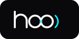

# Hoo Brand System — 2026

> Developer-native identity for an agentic AI ecosystem. Built on node geometry, signal propagation, and system-native typography.

## Overview

This repository contains the **Hoo Brand System 2026** design review — an HTML brand document (backed by a reusable `assets/` library) covering:

- **Symbol (C)** — Two *kissing* (tangent) nodes, a diamond spark at the touch-point, and bilateral signal arcs. Stands alone.
- **Monogram (A)** — A bold `h` glyph with a single cyan node in its counter. Stands alone (favicon / compact lock-up).
- **Master Wordmark** — Geometric `hoo`: an `h` + the two kissing nodes + a signal arc
- **HooCode** — JetBrains Mono suffix (medium) with a blinking cyan terminal cursor `_`
- **HooCowork** — JetBrains Mono suffix (regular) with a pulsing cyan “live presence” dot `●`
- Suffixes are set **smaller than the `hoo` mark** for hierarchy (cap-height ≈ node size)

## Files

| File | Description |
|------|-------------|
| `hoo_design_review.html` | Full brand review page (loads marks from `assets/`) |
| `assets/icon.svg` | **C** symbol app icon — kissing nodes on a dark tile (200×200) |
| `assets/symbol.svg` | **C** symbol only — transparent background mark |
| `assets/icon-mono.svg` | **A** monogram app icon — `h` + cyan node (200×200) |
| `assets/favicon.svg` | **A** monogram, favicon scale (32×32) |
| `assets/wordmark.svg` | Master `hoo` wordmark (160×80) |
| `assets/hoocode.svg` | HooCode product lockup (274×80) |
| `assets/hoocowork.svg` | HooCowork product lockup (315×80) |
| `scripts/build_lockups.py` | Regenerates the lockups from JetBrains Mono outlines |
| `scripts/glyphs_to_path.py` | Helper: font text run → SVG path + bounds |

Each mark also ships a **light / white-label** variant (dark ink on a light
surface) under the same name with a `-light` suffix:
`icon-light.svg`, `symbol-light.svg`, `icon-mono-light.svg`, `favicon-light.svg`,
`wordmark-light.svg`, `hoocode-light.svg`, `hoocowork-light.svg`.

### Logo system (C + A)

- **C** (kissing nodes) and **A** (`h` monogram) each work **standalone**.
- When **combined** (the `hoo` wordmark + product lockups = `h` *plus* nodes),
  the `h` drops its dot — the kiss-spark already carries the cyan accent.
- Early direction studies live in `assets/explore/` (monogram, signal, kiss).

## Assets & Usage

Reusable SVG marks live in `assets/`. Each is a standalone, optimized SVG with
`role="img"` and a `<title>` for accessibility. The brand review page
(`hoo_design_review.html`) loads these files directly via `` rather than
inlining them. Import wherever needed:

```html
<!-- As an image -->


<!-- As a favicon -->
<link rel="icon" type="image/svg+xml" href="assets/favicon.svg" />
```

```jsx
// As a React/Vite component
import HooCode from "./assets/hoocode.svg";
```

> **Dark marks** use the Zinc base `#09090B` with white (`#FAFAFA`) strokes — for
> dark surfaces. **`-light` marks** use ink (`#09090B`) strokes on a light
> (`#FAFAFA`) surface. Both keep the Signal Cyan `#00F0FF` accent.
>
> The `code` / `cowork` suffixes are **outlined to vector paths** from
> [JetBrains Mono Nerd Font](https://www.jetbrains.com/lp/mono/) (OFL), so the
> lockups render pixel-identical everywhere with no runtime font dependency.
> Regenerate them with `python3 scripts/build_lockups.py`.

## Design System

- **Fonts**: Inter (display) + JetBrains Mono (mono / terminal) via Google Fonts CDN, with system fallbacks. Lockup suffixes are JetBrains Mono **outlined to paths**.
- **Lockup grid**: suffix secondary to the mark (cap-height ≈ node, ~36px); all glyphs + nodes share one baseline (`y56`); ~11px divider gaps; tiles padded ~28px each side
- **Accent**: Signal Cyan `#00F0FF` (dim `rgba(0,240,255,0.15)`, glow `rgba(0,240,255,0.4)`)
- **Surfaces**: Zinc scale — `#09090B` (base) → `#18181B` (card) → `#27272A` (border)
- **Text**: `#FAFAFA` (white) → `#E4E4E7` → `#A1A1AA` → `#71717A` (muted)
- **Mode**: Dark (default) + Light, via sticky nav toggle (persisted to `localStorage`)
- **Type Scale**: Fluid `clamp()` (display ≈32px → 56px)
- **Radius**: Cards `20px`, panels/badges `16px`–`12px`

## Products

| Product | Suffix Style | Signal | Role |
|---------|-------------|--------|------|
| HooCode | JetBrains Mono, medium | Blinking cyan cursor `_` | Coding Agent |
| HooCowork | JetBrains Mono, regular | Pulsing cyan presence dot `●` | Workflow Agent |

## Page Sections

- **Nav** — Sticky bar with wordmark + light/dark theme toggle
- **Hero** — Title + brand positioning statement
- **Core Assets** — Card grid: Symbol, Master Wordmark, HooCode, HooCowork (`assets/` SVGs)
- **Color Palette** — Swatches for the zinc scale + Signal Cyan
- **Typography Scale** — Display / heading / body / label / mono samples
- **In-Context Application** — Terminal splash, GitHub badge, favicon scale (32px / 16px)

## Implemented Features

- [x] Reusable SVG asset library in `assets/` (dark + `-light` variants)
- [x] SVG accessibility — `role="img"` + `<title>` on every mark
- [x] Inter + JetBrains Mono via Google Fonts CDN
- [x] Fluid `clamp()` type scale
- [x] Light + dark mode with persisted nav toggle (swaps marks to `-light`)
- [x] Color palette + typography scale sections
- [x] Animated signals baked into the marks — HooCode cursor blink `_`, HooCowork presence-dot ping
- [x] Suffixes outlined to vector paths from JetBrains Mono (font-independent)
- [x] Baseline-locked lockup grid + symmetric tile padding
- [x] CSS color tokens via `:root` (zinc scale + cyan)
- [x] Responsive card grid with hover lift/border transitions
- [x] Cyan drop-shadow glow on logo previews
- [x] In-context usage examples (terminal, GitHub badge, favicons)
- [x] Mobile breakpoint at `768px`

---

**Author**: Sachin Koli ([@kolisachint](https://github.com/kolisachint))  
**Brand**: Hoo Ecosystem — agentic AI framework
