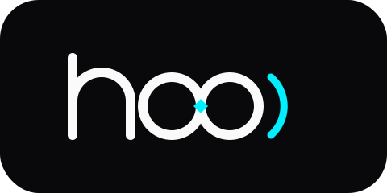
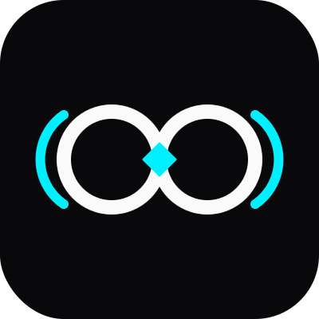
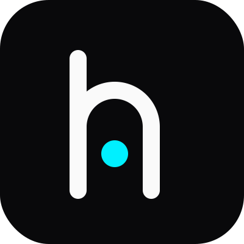
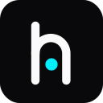
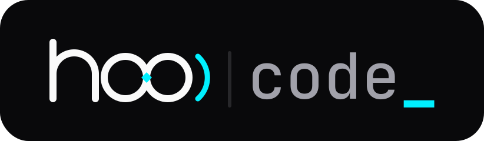
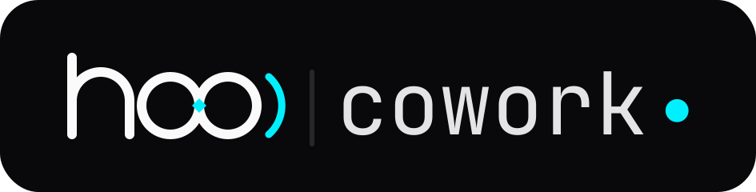
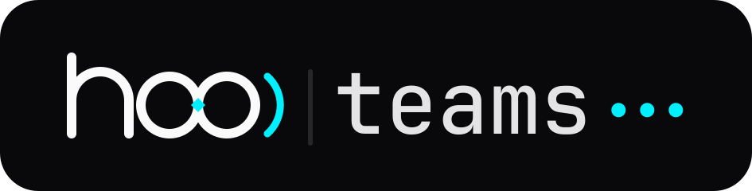

<div align="center">

<picture>
  <source media="(prefers-color-scheme: dark)" srcset="assets/png/wordmark.png">
  <source media="(prefers-color-scheme: light)" srcset="assets/png/wordmark-light.png">
  
</picture>

<br>

**Developer-native identity for an agentic AI ecosystem.**

Node geometry · Signal propagation · System-native typography

<br>

</div>

---

## Mark System

Two marks. Both standalone. Combined in the wordmark.

<br>

<table>
<tr>
<td align="center" width="33%">

<picture>
  <source media="(prefers-color-scheme: dark)" srcset="assets/png/icon.png">
  <source media="(prefers-color-scheme: light)" srcset="assets/png/icon-light.png">
  
</picture>

**Symbol** `C`
<br>
<sub>Kissing nodes + diamond spark</sub>

</td>
<td align="center" width="33%">

<picture>
  <source media="(prefers-color-scheme: dark)" srcset="assets/png/icon-mono.png">
  <source media="(prefers-color-scheme: light)" srcset="assets/png/icon-mono-light.png">
  
</picture>

**Monogram** `A`
<br>
<sub>`h` glyph · cyan node counter</sub>

</td>
<td align="center" width="33%">

<picture>
  <source media="(prefers-color-scheme: dark)" srcset="assets/png/favicon.png">
  <source media="(prefers-color-scheme: light)" srcset="assets/png/favicon-light.png">
  
</picture>

**Favicon**
<br>
<sub>32 × 32 · compact</sub>

</td>
</tr>
</table>

> **C** and **A** work independently. When combined in the `hoo` wordmark, the `h` drops its dot — the kiss-spark carries the accent.

---

## Wordmark

<br>

<picture>
  <source media="(prefers-color-scheme: dark)" srcset="assets/png/wordmark.png">
  <source media="(prefers-color-scheme: light)" srcset="assets/png/wordmark-light.png">
  
</picture>

`h` stem · kissing nodes · signal arc — master mark for all surfaces.

---

## Product Lockups

<br>

<picture>
  <source media="(prefers-color-scheme: dark)" srcset="assets/png/hoocode.png">
  <source media="(prefers-color-scheme: light)" srcset="assets/png/hoocode-light.png">
  
</picture>

<sub>Agentic coding agent — JetBrains Mono medium · blinking cyan cursor `_`</sub>

<br>
<br>

<picture>
  <source media="(prefers-color-scheme: dark)" srcset="assets/png/hoocowork.png">
  <source media="(prefers-color-scheme: light)" srcset="assets/png/hoocowork-light.png">
  
</picture>

<sub>Workflow agent — JetBrains Mono regular · pulsing cyan presence dot `●`</sub>

<br>
<br>

<picture>
  <source media="(prefers-color-scheme: dark)" srcset="assets/png/hooteams.png">
  <source media="(prefers-color-scheme: light)" srcset="assets/png/hooteams-light.png">
  
</picture>

<sub>Multi-agent orchestration — JetBrains Mono medium · three sequential-blink relay nodes `···`</sub>

<br>

| Product | Signal | Role |
|---------|--------|------|
| **HooCode** | Blinking cursor `_` | Coding agent |
| **HooCowork** | Pulsing dot `●` | Workflow agent |
| **HooTeams** | Relay nodes `···` | Multi-agent orchestration |

> Suffixes are outlined to vector paths from [JetBrains Mono](https://www.jetbrains.com/lp/mono/) (OFL) — pixel-identical everywhere, zero runtime font dependency.

---

## Color System

<br>

### Signal

| Token | Hex | Use |
|-------|-----|-----|
| `--cyan` | `#00F0FF` | Accent · spark · cursor · presence |
| `--cyan-dim` | `rgba(0,240,255,0.15)` | Glow fill |
| `--cyan-glow` | `rgba(0,240,255,0.40)` | Drop shadow |

### Zinc Scale (Dark → Light)

| Token | Hex | Role |
|-------|-----|------|
| `--base` | `#09090B` | Background · dark tile |
| `--card` | `#18181B` | Card surface |
| `--border` | `#27272A` | Border · divider |
| `--text` | `#FAFAFA` | Primary text · strokes |
| `--text-2` | `#E4E4E7` | Secondary text |
| `--text-3` | `#A1A1AA` | Tertiary |
| `--muted` | `#71717A` | Muted / disabled |

---

## Typography

| Role | Typeface | Weight | Notes |
|------|----------|--------|-------|
| Display / UI | Inter | 300–700 | Via Google Fonts CDN |
| Mono / terminal | JetBrains Mono | Regular · Medium | Lockup suffixes outlined to paths |
| Scale | `clamp()` fluid | — | Display ≈ 32 → 56px |

---

## Terminal

A developer-native brand needs a terminal face. The owl mark uses **quadrant block glyphs** — the two dome eyes (`▟▙`) are the `oo` nodes in cyan.

```
▟▀▀▀▀▀▙  hoo│code
▌▟▙ ▟▙▐  agentic coding agent · v0.1.0
▜▄▄▄▄▄▛  ~/github/hoocode
```

```sh
cat assets/tui/startup.ans   # boot card
cat assets/tui/owl.ans       # owl mark
python3 scripts/build_banner.py  # regenerate
```

---

## Usage

```html
<!-- Image -->


<!-- Favicon -->
<link rel="icon" type="image/svg+xml" href="assets/favicon.svg" />

<!-- Dark/light mode in HTML -->
<picture>
  <source media="(prefers-color-scheme: dark)" srcset="assets/wordmark.svg">
  <source media="(prefers-color-scheme: light)" srcset="assets/wordmark-light.svg">
  
</picture>
```

```jsx
// React / Vite
import HooCode from "./assets/hoocode.svg";
```

---

## Asset Index

### Core marks

| File | Format | Description |
|------|--------|-------------|
| `assets/icon.svg` · `png` | 200×200 | Symbol **C** — dark tile |
| `assets/icon-light.svg` · `png` | 200×200 | Symbol **C** — light tile |
| `assets/icon-mono.svg` · `png` | 200×200 | Monogram **A** — dark tile |
| `assets/icon-mono-light.svg` · `png` | 200×200 | Monogram **A** — light tile |
| `assets/favicon.svg` · `png` | 32×32 | Favicon — dark |
| `assets/favicon-light.svg` · `png` | 32×32 | Favicon — light |
| `assets/symbol.svg` · `png` | 168×80 | Symbol mark — transparent |
| `assets/symbol-light.svg` · `png` | 168×80 | Symbol mark — light transparent |
| `assets/wordmark.svg` · `png` | 160×80 | Master wordmark — dark |
| `assets/wordmark-light.svg` · `png` | 160×80 | Master wordmark — light |
| `assets/hoocode.svg` · `png` | 274×80 | HooCode lockup — dark |
| `assets/hoocode-light.svg` · `png` | 274×80 | HooCode lockup — light |
| `assets/hoocowork.svg` · `png` | 315×80 | HooCowork lockup — dark |
| `assets/hoocowork-light.svg` · `png` | 315×80 | HooCowork lockup — light |
| `assets/hooteams.svg` · `png` | 315×80 | HooTeams lockup — dark |
| `assets/hooteams-light.svg` · `png` | 315×80 | HooTeams lockup — light |

Each SVG ships a paired PNG at 2–4× in `assets/png/`.

### Exploration

Early direction studies in `assets/explore/` (kiss, monogram, signal) + PNGs in `assets/png/explore/`.

### TUI

| File | Description |
|------|-------------|
| `assets/tui/owl.ans` | Block-glyph owl — square blot, cyan eyes |
| `assets/tui/owl.txt` | Plain-text version |
| `assets/tui/startup.ans` | Boot card — owl + product info |

### Scripts

| Script | Purpose |
|--------|---------|
| `scripts/build_lockups.py` | Regenerate lockups from JetBrains Mono outlines |
| `scripts/glyphs_to_path.py` | Font text run → SVG path + bounds |
| `scripts/build_banner.py` | Generate terminal owl mark + boot card |

---

## Design Tokens (quick ref)

```css
:root {
  /* Signal */
  --hoo-cyan:      #00F0FF;
  --hoo-cyan-dim:  rgba(0, 240, 255, 0.15);
  --hoo-cyan-glow: rgba(0, 240, 255, 0.40);

  /* Zinc */
  --hoo-base:    #09090B;
  --hoo-card:    #18181B;
  --hoo-border:  #27272A;
  --hoo-white:   #FAFAFA;
  --hoo-text-2:  #E4E4E7;
  --hoo-text-3:  #A1A1AA;
  --hoo-muted:   #71717A;

  /* Radius */
  --hoo-r-card:  20px;
  --hoo-r-badge: 12px;
}
```

---

<div align="center">
<sub>
<b>Hoo Ecosystem</b> — agentic AI framework &nbsp;·&nbsp;
<a href="https://github.com/kolisachint">@kolisachint</a>
</sub>
</div>
